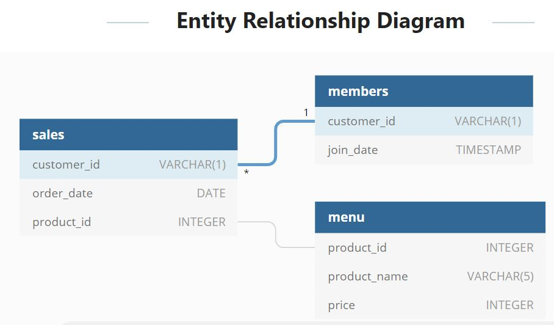

The Casse Study 1 is simple. You can read the Introduction and Problem Statemnt here :https://8weeksqlchallenge.com/case-study-1/   
  
Basically, our client, Danny, opens up a cute little restaurant that sells his 3 favourite foods: sushi, curry and ramen. He has provided us with a sample of his overall customer data and  wants to use theses data to answer a few simple questions about his customers.

We have 3 datasets:  
* sales
* menu
* members  
You can refer to the relationship diagram below to understand the connection between the three datasets

